# 小熊代跑微信小程序

#### 介绍

##### 小程序二维码

注：此二维码为测试版，申请一下开发者点同意就OK啦

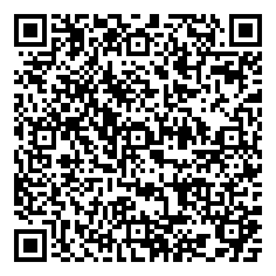

​	目前由于涉及到用户自己上传内容，个人微信小程序不支持

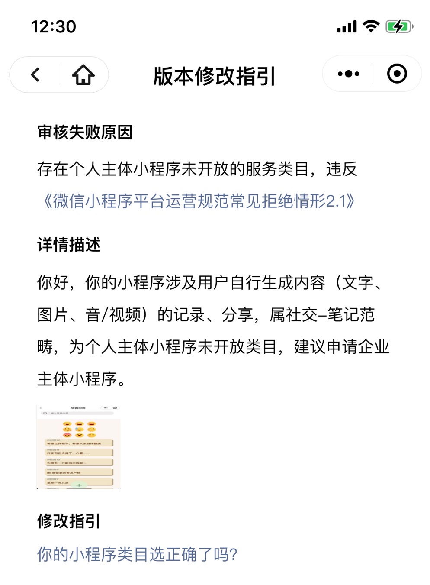

​	这是2020级敏捷开发的小程序，目前仍在开发过程中。在这个小程序里，可以**发布外卖、快递的代领**消息，以及**领取代领任务**；可以查看软微校区内的**二手商品信息**和失物招领信息；此外，还有**树洞和组队拼车合租**板块。

#### 软件展示

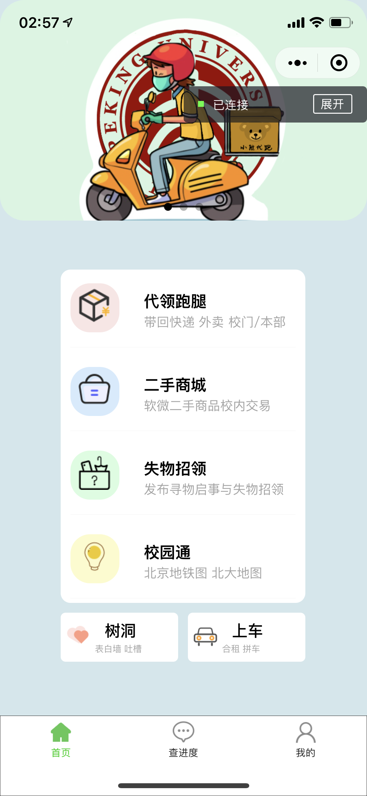

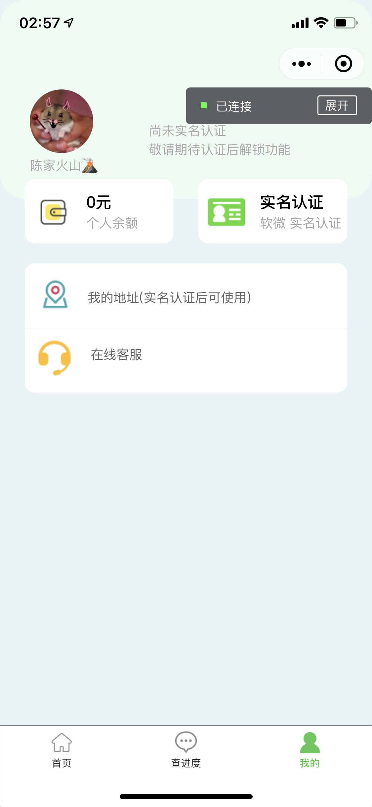

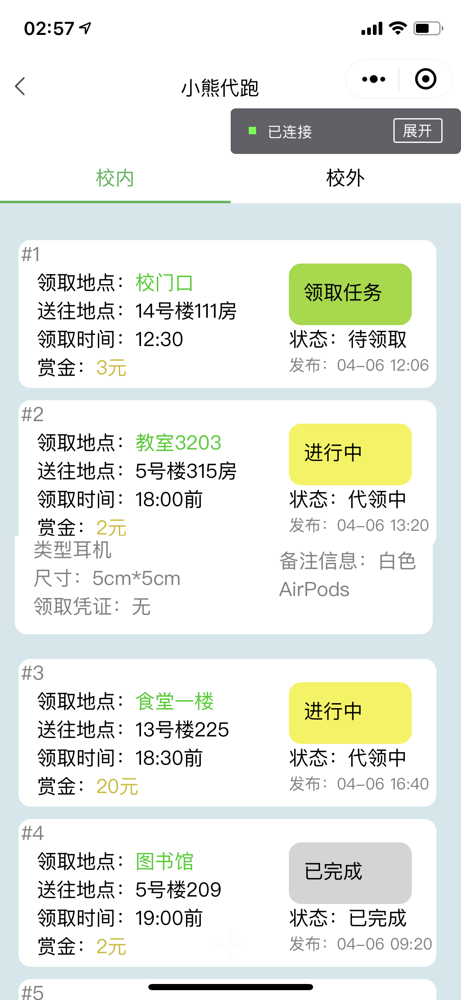

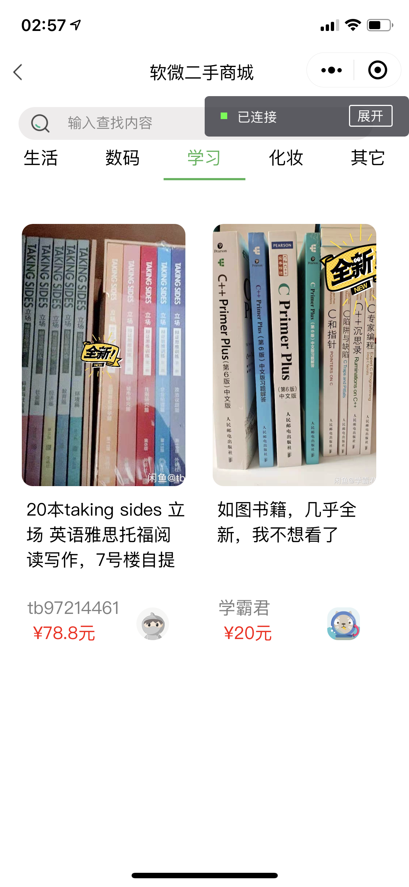


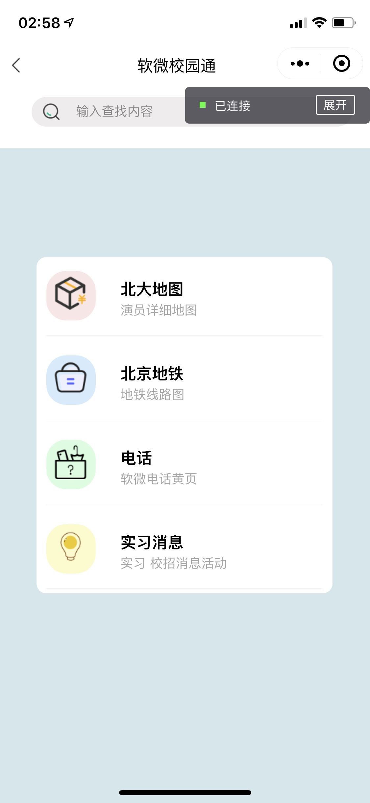

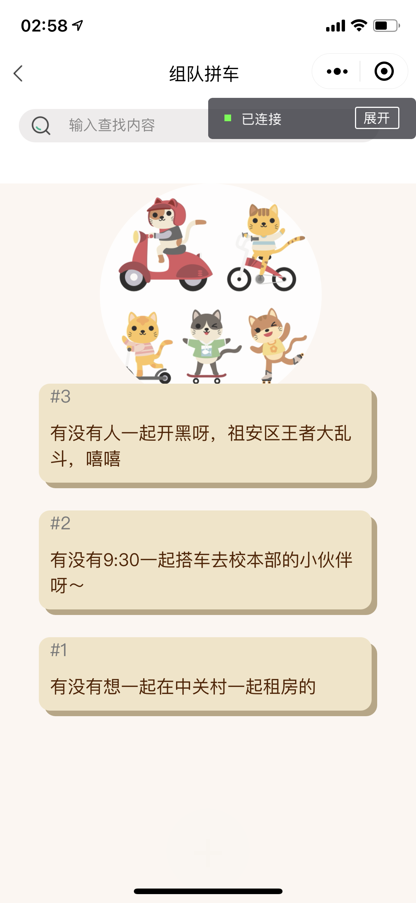

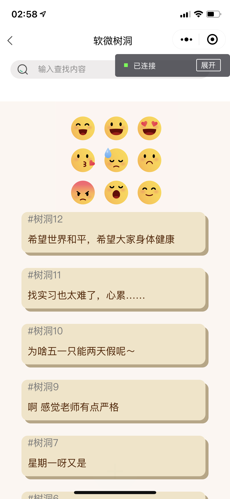

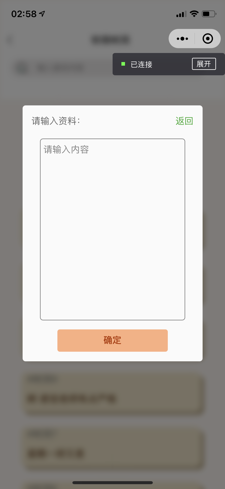

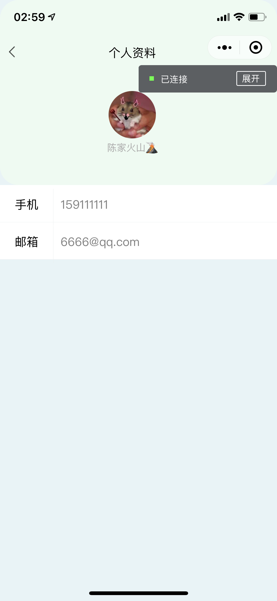

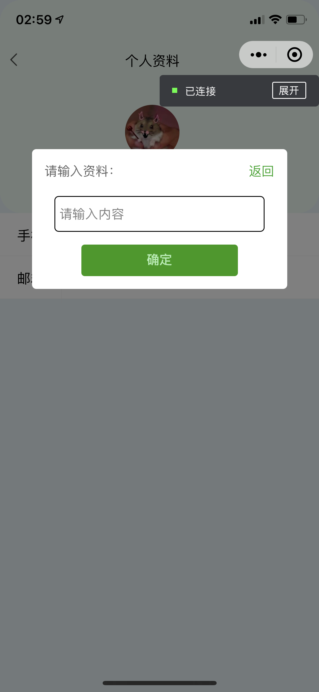

#### 目前的问题

##### 未完成：

- [ ] 数据库的设计
- [ ] 代领板块的具体业务逻辑
- [ ] 二手商城、失物招领的发布
- [ ] 许多表单需要进一步检验内容合法性
- [ ] 实名认证的逻辑
- [ ] 解决个人微信小程序无法充值的问题
- [ ] 个人微信小程序不能让个人用户发布消息

##### 未解决的bug：

- [ ] 电脑端在“软微树洞”以及“拼车”板块可以见fixed的加号button发布新消息，手机端不显示加号，但可以点击发布新消息

  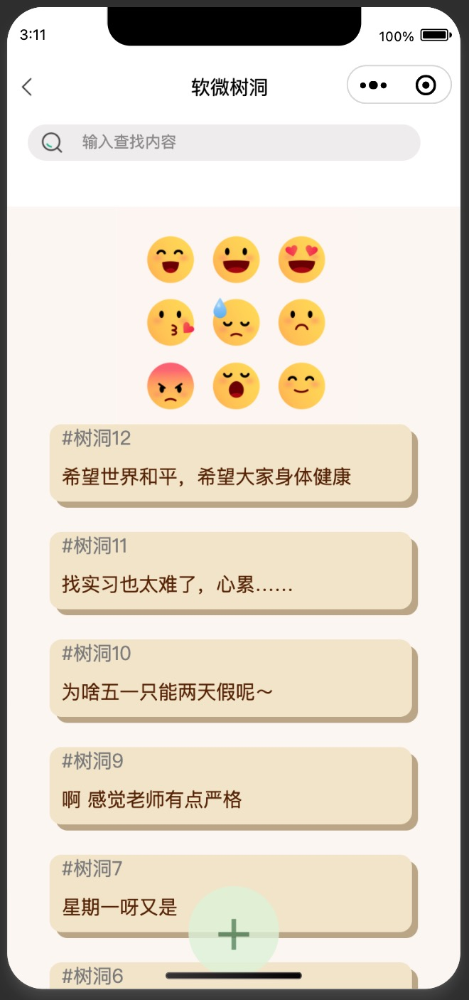

  

  

- [ ]  在form合法性校验时，console显示length未定义

```shell
VM1108 WAService.js:2 TypeError: Cannot read property 'length' of undefined
    at se.formSubmit (errand.js? [sm]:55)
    at Object.n.safeCallback (VM1108 WAService.js:2)
    at VM1108 WAService.js:2
    at n (VM1108 WAService.js:2)
    at VM1108 WAService.js:2
    at VM1108 WAService.js:2
    at i (VM8 asdebug.js:1)
    at c (VM8 asdebug.js:1)
    at VM8 asdebug.js:1
    at Set.forEach (<anonymous>)
```


